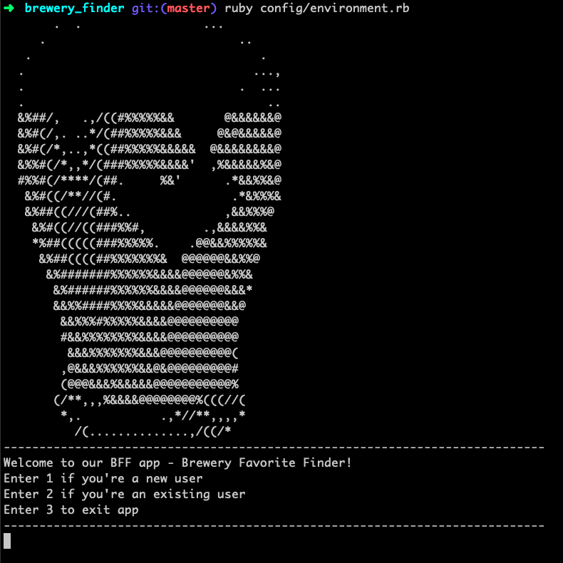
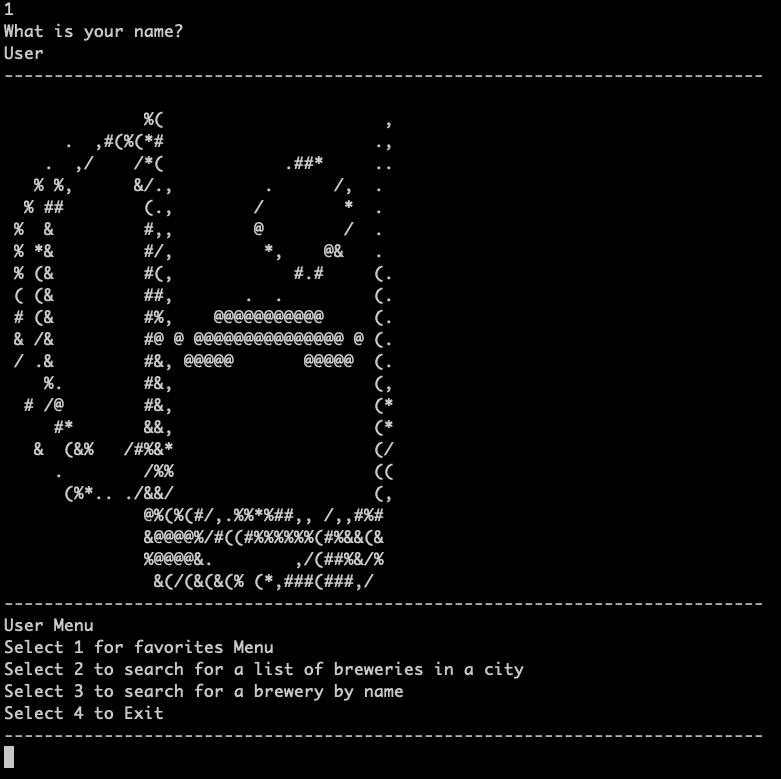
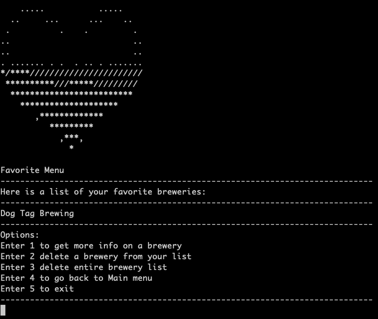
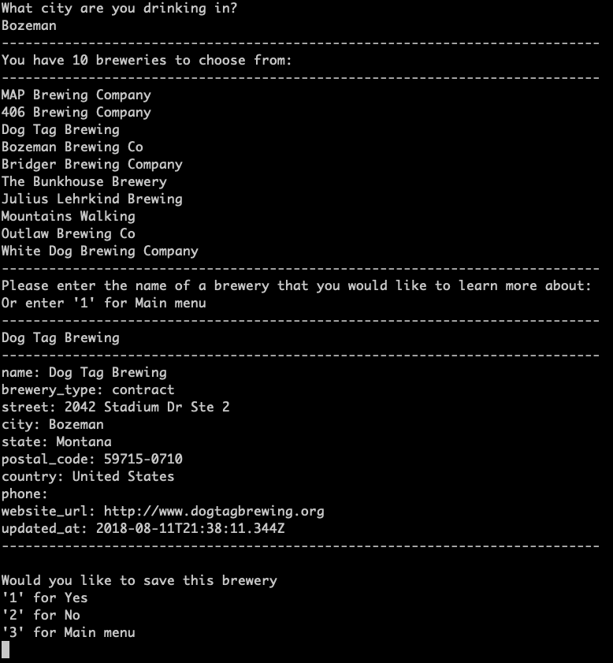

# BFF - Brewery Favorite Finder

## App for finding breweries based on location and user criteria

Project by @darnold001 and @rjortega
Thanks for checking it out!

## Installation
   1 Clone our repo into the directory where you want the app
   2 If you have bundler, run a ```bundle install``` in the root folder of the app to install assets
   3 Open up terminal and run the environment running ```ruby config/environment.rb```
   4 Have fun!
   
   ###### if you don't have bundler or ruby, get it here! [Link to Bundler!](https://bundler.io/), [Link to Ruby!](https://www.ruby-lang.org/en/downloads/)

## Basic flow of app

### Welcome Menu
   * Create user or hit database for existing user
   

### User Menu
   * Access to Favorites menu
   * Ability to look up brewery by city or name
   

### Favorite menu
   * Ability to see favorite breweries
   * Lets you query API for up to date information on brewery
   * Allows you to delete a brewery from database linked to current user
   * Allows you to delete ALL breweries from both:
      * the database linked to the user
      * the associated brewery table
   

### API Brewery Query
   * Built method to accept user input and query API for information using either:
      * City
      * Name of brewery
   * After query user is prompted with the choice to save to favorites list
   
   

### Model
"    ______            __________________               _________    "
"   | User |>---------| Favorite Brewery |------------<| Brewery |   "
"    ‾‾‾‾‾‾            ‾‾‾‾‾‾‾‾‾‾‾‾‾‾‾‾‾‾               ‾‾‾‾‾‾‾‾‾    "

### Assets used:
   * Ruby
   * jQuery
   * Sinatra
   * ActiveRecord
   * Sqlite3
   * JSON
   * Rake
   * Rest-Client
   * Binding.pry

#### Credits
      * API : thanks to Open Brewery DB for giving open access to their api
         *created and maintained by Chris J Mears and Wandering Leaf Studios LLC.
         *[link to API!](https://www.openbrewerydb.org)
      * Thanks to Flatiron Schools for guided support 